# Conceitos Básicos

* **Grafos:** modelos matemáticos que permitem codificar relacionamento entre pares de objetos.
* **Estrutura:** Conjunto de nós (vértices) conectados par-a-par por linhas (arestas).

---

## A) Conceitos de Grafos

### 1. Tipos de Direcionamento
* **Grafos dirigidos (ou direcionados):** são dígrafos.
    * As relações apresentadas pelas arestas têm sentido definido;
    * Arestas só podem ser seguidas em uma única direção.
    * Em grafos direcionados as arestas são pares ordenados de vértices, mesmo que ambos sejam o mesmo vértice (ditos autolaços).
* **Grafos não dirigidos ou não direcionados:**
    * Relações pelas arestas não têm sentido.
    * Podemos pensar como um grafo dirigido de mão dupla, porém:
        * Autolaços (self-loops) não são permitidos.

### 2. Adjacência e Grau
* **Adjacência / Vizinho:**
    * Se $(u, v)$ é uma aresta no grafo, então $v$ é adjacente a $u$ (ou que $v$ é vizinho de $u$).
    * **OBS:** $(u, v)$ significa que a aresta sai de $u$ e chega em $v$.
    * Em grafos não dirigidos a relação de adjacência é simétrica: $(u, v) \iff (v, u)$.
* **Grau do Vértice $Gr()$:**
    * **Em grafos não-dirigidos:** número de arestas que conectam no vértice.
    * **Em grafos dirigidos:** grau total do vértice = nº de arestas que saem + nº de arestas que entram.
    * **OBS:** Autoloop soma como $+2$.

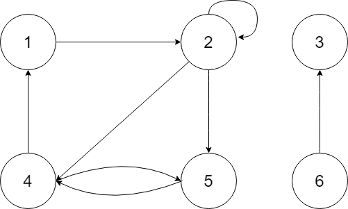

> **Exemplo da imagem:** $Grau(V(2)) = (1) + (1+1) + 2 = 5$

* **Divisão em grafos dirigidos:**
    1.  **Grau de saída:** nº de arestas que saem do vértice ($Gr(V2\text{-saída})$) = 3.
    2.  **Grau de entrada:** nº de arestas que entram do vértice ($Gr(V2\text{-entrada})$) = 2.

### 3. Caminhos e Ciclos
* **Caminho:** sequência de vértices que ligam vértice $X$ a vértice $Y$ usando arestas.

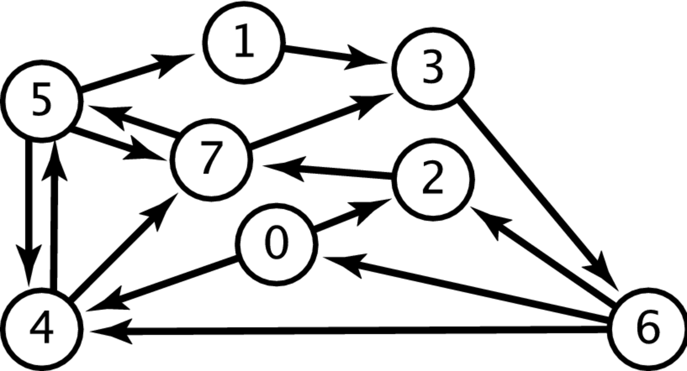

* **Exemplo:** caminho do vértice(7) ao vértice (2): $(V(7), V(3), V(6), V(2))$.
* **Comprimento do Caminho (compr):** número de arestas no caminho de um vértice $X$ a $Y$ (e.g: $compr(cam) = 3$ no anterior).
* **Ciclo:** ocorre quando a partir de um vértice podemos percorrer algum caminho que nos leve a esse mesmo vértice.
    1.  Em grafos dirigidos: deve conter pelo menos uma aresta (caso de autolaço).
    2.  Em grafos não-dirigidos: deve conter pelo menos 3 arestas.
    * **Classificação:** Grafos que contém pelo menos um ciclo são ditos **cíclicos**, e os que não contém, **acíclicos**.

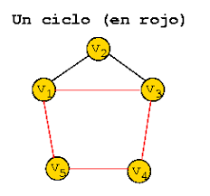

### 4. Conectividade (Conexo / Conectado)
1.  **Grafo não direcionado conexo:** cada par de vértice nele está conectado por um caminho.
2.  **Grafo dirigido fortemente conexo:** existe um caminho entre qualquer par de vértices (de $u$ para $v$ e de $v$ para $u$).
3.  **Grafo dirigido conexo:** existe um caminho de $u$ para $v$ OU de $v$ para $u$ para cada par de vértices. Todo fortemente conexo é também conexo.
4.  **Grafo dirigido fracamente conexo:** se a substituição de todas as suas arestas por não-direcionadas produz um grafo conexo.

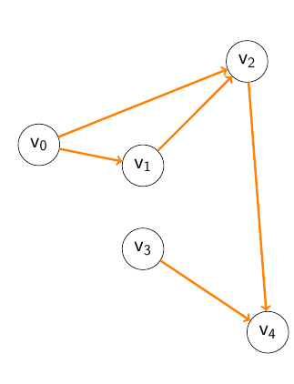

> **Exemplo:** não há caminho de $v3$ para $v2$ nem o contrário, mas se trocarmos por arestas não direcionadas, vira um grafo conexo; logo, é fracamente conexo.

### 5. Propriedades Adicionais
* **Clique:** Em grafos não dirigidos, é um subconjunto de vértices onde cada par é conectado por uma aresta.
    * O tamanho do clique é o número de elementos desse subconjunto.
    * Exemplo: clique de tamanho 3 forma um triângulo.
* **Ponderamento de Grafos:** Grafos onde um peso (custo, distância) é associado a cada aresta.
* **Grafos Transpostos $G^T$:** Apenas para dirigidos. Mesmos vértices, mas com direções das arestas invertidas.

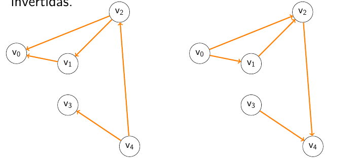

---

## B) Subgrafos e Tipos Específicos

### 1. Subgrafos
Um grafo $H$ é subgrafo de $G$ se todo vértice e aresta de $H$ também pertencem a $G$.
* **OBS:** Não se pode "inventar" elementos que não estão em $G$.

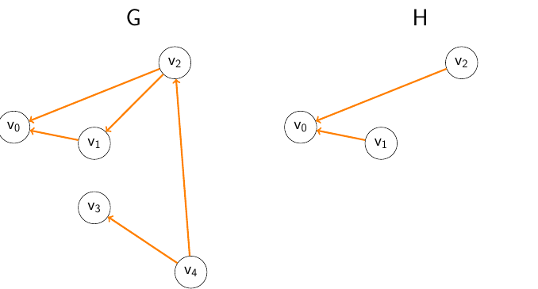

1.  **Subgrafo gerador (spanning):** Contém todos os vértices de $G$.
2.  **Subgrafo induzido:** Se contém um par de vértices, deve conter **todas** as arestas que os ligam no grafo original.
    * Em grafos dirigidos, pode-se omitir uma aresta $(u, v)$ apenas se $u$ ou $v$ não estiverem no subgrafo.
3.  **Subgrafo Próprio:** Diferente de $G$ em qualquer aspecto (menos vértices ou menos arestas).

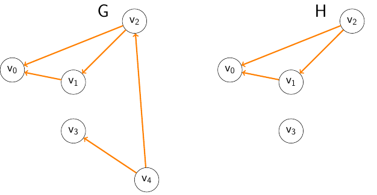

### 2. Grafos Específicos
* **Grafos Bipartidos:**
    * Vértices divididos em dois conjuntos distintos sem arestas internas.
    * Não contém ciclos de comprimento ímpar (pode ser colorido com 2 cores).
    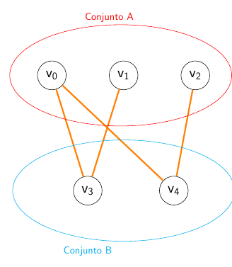
* **Multigrafo:** Permite arestas múltiplas entre o mesmo par de vértices.
    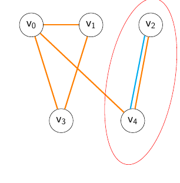
* **Grafo Misto:** Possui arestas direcionadas e não direcionadas.

---

## C) Representação de Grafos

### 1. Representação Visual e Computacional
* **Visual/Humana:** Mapeamento de cada nó à sua lista de conexões.
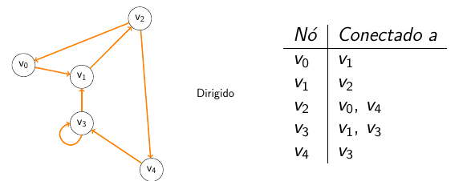

* **Matriz de Adjacência:** Matriz $n \times n$.
    1.  $A[i,j] = 1$ se houver aresta de $i$ para $j$.
    2.  $A[i,j] = 0$ caso contrário.
    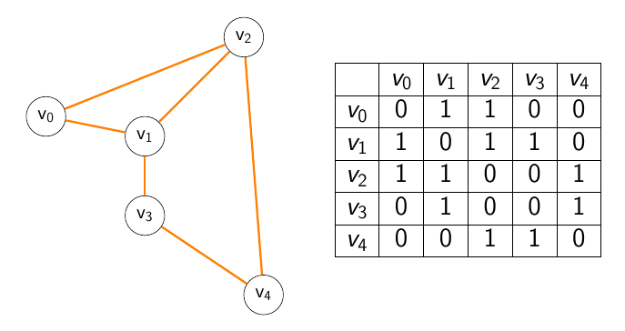
    * Simétrica para não-dirigidos. Para ponderados, armazena o peso.

* **Lista de Adjacência:** Arranjo de $n$ listas ligadas.
    1.  Para cada vértice $u$, a lista contém todos os seus vizinhos $v_i$.
    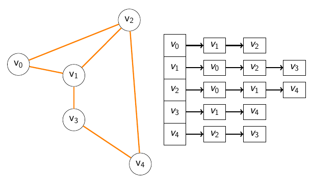
    * Para ponderados, os vizinhos são registros com um campo adicional para o peso.
    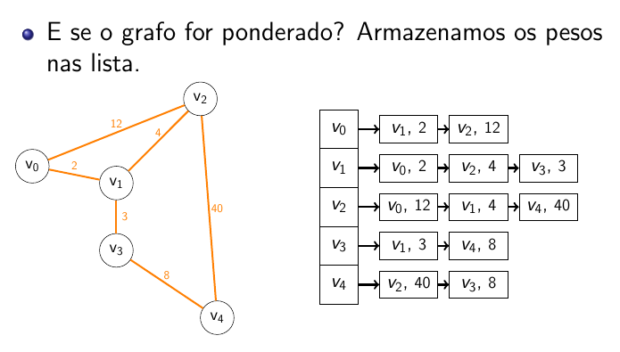

### 2. Escolha de Representação
* **Grafo Denso:** Muitas arestas (preferência por Matriz).
* **Grafo Esparso:** Poucas arestas (preferência por Lista).
