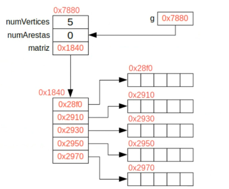
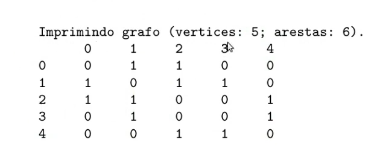

# Implementação de Matriz de Adjacência (I)
## Grafos Não Dirigidos e Não Ponderados

Esta nota aborda a implementação de uma estrutura de dados para grafos utilizando matrizes de adjacência binárias. O foco é em grafos **não dirigidos** (matriz simétrica) e **não ponderados**.

### 1. Estrutura de Dados
A estrutura utiliza alocação dinâmica para permitir que o número de vértices seja definido em tempo de execução.

```c
typedef struct {
    int numVertices; // número de vértices constante (V)
    int numArestas;  // contador para garantir consulta O(1)
    bool ** matriz;  // matriz de V x V
} Grafo;
```

---

### 2. Inicialização e Exibição

#### A) Inicializar o Grafo
A função aloca memória para o array de ponteiros (linhas) e, em seguida, para cada linha (colunas), inicializando os valores como `false`.

```c
bool inicializaGrafo(Grafo * G, int vertices) {
    if (vertices < 1 || G == NULL) return false;
    
    G->numVertices = vertices;
    G->numArestas  = 0;
    G->matriz = (bool **) malloc(sizeof(bool *) * vertices);
    for (int i = 0; i < vertices; i++) {
        G->matriz[i] = (bool *) malloc(sizeof(bool) * vertices);
        for (int j = 0; j < vertices; j++)
            G->matriz[i][j] = false; 
    }
    return true;
} // Complexidade: O(V²)
```



#### B) Exibir o Grafo
Percorre a matriz imprimindo os valores binários para cada par de vértices.

```c
void exibeGrafo(Grafo * G) {
    for (int i = 0; i < G->numVertices; i++) {
        printf("%i: ", i);
        for (int j = 0; j < G->numVertices; j++) {
            printf("%d ", G->matriz[i][j]);
        }
        printf("\n");
    }
}
```



> **Exemplo de Grafo Não Dirigido:**
> No exemplo acima, as conexões são:
> * V(0) conectado a V(1), V(2)
> * V(1) conectado a V(0), V(2), V(3)
> * V(2) conectado a V(0), V(1), V(4)
> * V(3) conectado a V(1), V(4)
> * V(4) conectado a V(2), V(3)

---

### 3. Gerenciamento de Memória e Arestas

#### C) Liberar Memória
Deve-se liberar primeiro cada linha individualmente antes de liberar o ponteiro da matriz.

```c
bool liberaGrafo(Grafo * G) {
    if (G == NULL) return false;
    for (int i = 0; i < G->numVertices; i++) {
        free(G->matriz[i]);
    }
    free(G->matriz);
    
    G->numVertices = 0;
    G->numArestas  = 0;
    G->matriz = NULL;
    return true;
} // Complexidade: O(V)
```

#### D) Inserir uma Aresta
Como o grafo é não dirigido, a inserção deve ser simétrica: `(v1, v2)` e `(v2, v1)`.

```c
bool insereAresta(Grafo * G, int v1, int v2) {
    if (G == NULL || v1 == v2 || v1 < 0 || v2 < 0 || v1 >= G->numVertices || v2 >= G->numVertices) 
        return false;
        
    if (G->matriz[v1][v2] == false) {
        G->matriz[v1][v2] = true;
        G->matriz[v2][v1] = true;
        G->numArestas++;
    }
    return true;
} // Complexidade: O(1)
```

#### E) Remover uma Aresta
```c
bool removeAresta(Grafo * G, int v1, int v2) {
    if (G == NULL || v1 < 0 || v2 < 0 || v1 >= G->numVertices || v2 >= G->numVertices || G->matriz[v1][v2] == false) 
        return false;

    G->matriz[v1][v2] = false;
    G->matriz[v2][v1] = false;
    G->numArestas--;
    return true;
} // Complexidade: O(1)
```

---

### 4. Consultas e Propriedades

#### F) Verificação de Existência e Contagem
* **arestaExiste:** Retorna o valor booleano na posição $[v1][v2]$.
* **numeroDeVertices/Arestas:** Retorna os valores armazenados na struct em $O(1)$.

```c
int numeroDeArestas(Grafo * G) {
    if (G == NULL) return -1;
    return G->numArestas;
}
```

#### G) Grau do Vértice e Vizinhos
Para verificar se um vértice possui vizinhos ou calcular seu grau, percorremos sua linha correspondente na matriz.

```c
int grauVertice(Grafo * G, int v) {
    if (G == NULL || v < 0 || v >= G->numVertices) return -1;
    int grau = 0;
    for (int x = 0; x < G->numVertices; x++) {
        if (G->matriz[v][x]) grau++;
    }
    return grau;
} // Complexidade: O(V)
```
